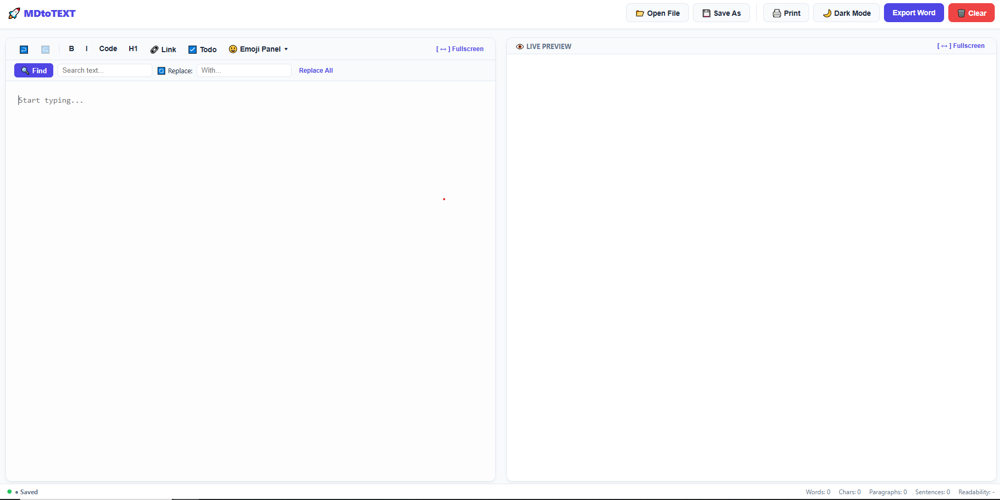

# MDtoTEXT

A blazing fast, zero-dependency, and completely autonomous Markdown editor that runs directly in your browser. No servers, no frameworks, no tracking — just pure performance and a clean writing space.

---

## ⚡ Features

* **Instant Live Preview:** Real-time side-by-side Markdown rendering.
* **Smart Auto-Save:** Instant local sync via `localStorage` with a visual database state indicator.
* **Robust History Engine:** Integrated local Undo (`Ctrl+Z`) and Redo (`Ctrl+Y`) tracking your last 30 changes.
* **Developer-Grade DX:** Smart auto-closing and wrapping for pairs like brackets `()`, code-ticks \``\``, and markdown formatting tags.
* **Advanced Find & Replace:** Real-time text search with backdrop highlights and global replacement.
* **Deep Text Metrics:** Live trackers for Words, Characters, Paragraphs, Sentences, and an integrated readability complexity score.
* **Rich Emoji Panel:** A categorized popover library with over 48 built-in emojis for instant insertion.
* **Universal File System Actions:** Bulletproof, secure offline file loading (`Open File`) and local downloads (`Save As`) working across all modern browsers without server permission blockers.
* **Dynamic Theme System:** Seamlessly toggles between sleek Light and native Dark modes with persistent storage.

---

## 🛠️ Built With

Engineered using pure **Vanilla JS, HTML5, and CSS3** to ensure sub-millisecond rendering and close-to-zero memory leaks. It hooks into reliable web CDNs for core parsing:
* [Marked.js](https://marked.js.org/) — Fast Markdown compiler.
* [Highlight.js](https://highlightjs.org/) — Code block colorizer.
* [MathJax](https://www.mathjax.org/) — LaTeX mathematical rendering.

---

## 🚀 Getting Started

Since the app runs entirely on client-side architecture, setting it up takes seconds:

1. **Clone** or download this repository.
2. Open the `index.html` file in any modern web browser.
3. To host it live for free, simply push it to GitHub and enable **GitHub Pages** in your repository settings.

---

## 📄 License

This project is licensed under the MIT License - see the [LICENSE](LICENSE) file for details. Free to use, modify, and distribute!
